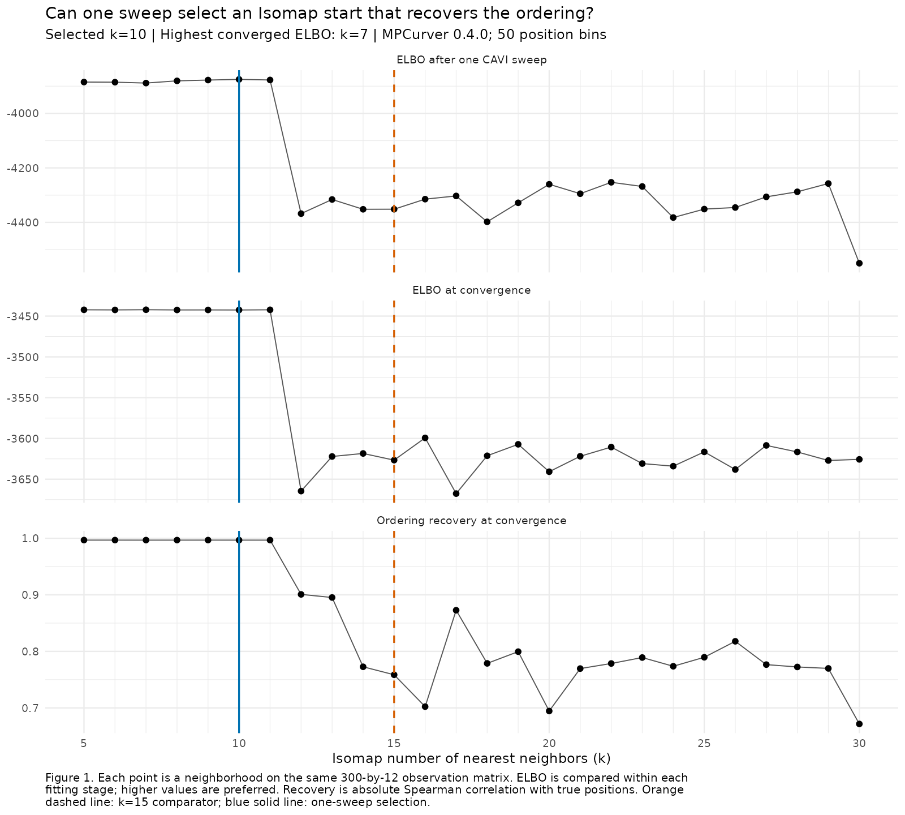
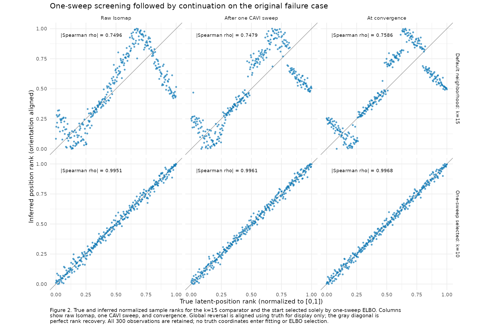

# One-sweep ELBO screening of Isomap neighborhoods

On the original folded-ordering case, a single MPCurve CAVI sweep selected
Isomap k=10 and recovered the ordering after continuation: absolute Spearman
correlation increased from 0.7586 with k=15 to 0.9968. Searching every integer
k from 5 through 30 took a median 2.615 seconds including continuation,
compared with 11.270 seconds for fitting all 26 candidates to convergence.
The same one-sweep rule on five neighborhoods took 0.967 seconds and also
selected k=10. A single k=15 fit took 0.289 seconds, so screening improves
recovery here while adding cost to the single-start baseline.

This is an internal experiment with MPCurver 0.4.0, source commit
`f1511a013739ff4f754963e087466cdcedd910ea`. It isolates the known 12-feature
B group from the saved `main_M5_S4_r001` dataset: 300 samples, variance SNR 4,
and unchanged observations/noise. All candidates have 50 position bins, RW2,
adaptive precision/noise/position probabilities, and identical fitting settings.
Here k denotes graph neighbors, not the number of position bins. See
[DESIGN.md](DESIGN.md) for settings, selection rules, and timing exclusions.

The selector receives only observations and one-sweep ELBOs. It chooses before
any candidate endpoint is computed, then `do_mpcurve()` resumes the selected
one-sweep posterior and parameters. The feature group is supplied from the
saved simulation truth; true positions are used only to evaluate recovery and
align display orientation. This experiment does not evaluate feature grouping.

Table 1 compares the default neighborhood, the one-sweep choice, and the
highest-ELBO converged candidate. Figure 1 shows the full candidate set;
Figure 2 shows the same samples before and after fitting.

Table 1. Candidate ELBOs and ordering recovery on the identical input and
model. Recovery is absolute Spearman correlation with true latent positions.
Iterations count CAVI sweeps after initialization, including the scoring sweep.
Convergence uses absolute ELBO increment divided by 300 times 12 below 1e-6.

| Candidate | k | One-sweep ELBO | Converged ELBO | Final recovery | Sweeps |
| --- | ---: | ---: | ---: | ---: | ---: |
| Default neighborhood | 15 | -4351.641 | -3626.589 | 0.758614 | 63 |
| One-sweep selection | 10 | -3875.176 | -3442.507 | 0.996760 | 168 |
| Highest converged ELBO among 26 | 7 | -3888.654 | -3442.216 | 0.996746 | 199 |

The selected fit improves final ELBO over k=15 by 184.0821. Its ELBO is 0.2908
below the best converged candidate, or 0.0000808 per observation. Thus one sweep
selects the successful ordering basin in this example, while its ranking does
not reproduce the exact ranking of converged ELBOs. The best candidate means
the highest endpoint under the stated stopping rule, not a proven global optimum.





Table 2 reports five complete sequential timing repeats after one warmup per
pipeline. Dense screening uses all integers 5:30; sparse screening uses the
prespecified set {5,10,15,20,30}. Timings include embeddings, initial posterior
calculations, scoring, and selected continuation. All-candidate endpoints are
excluded from screening cost. Package loading, file I/O, and reporting are
excluded consistently; repeats describe this host and dataset.

Table 2. Complete-pipeline elapsed time in seconds. Ranges are minimum to
maximum across five repeats, not uncertainty intervals. The baseline multiplier
is the median paired time ratio within each repeat.

| Pipeline | Selected k | Median seconds | Range | Multiplier versus k=15 |
| --- | ---: | ---: | --- | ---: |
| Single k=15 fit | 15 | 0.289 | 0.287–0.290 | 1.00 |
| Five-candidate one-sweep screen + continuation | 10 | 0.967 | 0.950–0.995 | 3.35 |
| 26-candidate one-sweep screen + continuation | 10 | 2.615 | 2.578–2.653 | 9.05 |
| All 26 candidates to convergence | 7 | 11.270 | 11.238–11.288 | 39.06 |

Dense screening reduces median total time by 76.8% relative to dense completed
search. Its screening stage costs a median 2.030 seconds and selected
continuation 0.583 seconds. Sparse screening costs 0.374 seconds before
continuation and adds a median paired 0.678 seconds to the k=15 baseline.
Screening is useful for this failure case, but its cost is substantial relative
to an inexpensive standalone fit. The selected solution also takes more sweeps
than the folded baseline (Table 1).

As a secondary audit, initial-state ELBO (X=0) selects k=8 and also recovers
well (0.996768); X=2 selects k=10, and X=3/5/10 selects k=5. These comparisons
use saved objective prefixes and are in [selection_by_budget.csv](selection_by_budget.csv).
This case therefore supports the proposed X=1 pipeline without establishing
that one sweep is necessary or universally sufficient. Fixed k=5 or k=10 also
works here. Generalization to different trajectories, noise, sampling densities,
or incorrectly inferred feature groups remains open.

A subsequent [graph-bound diagnostic](literature_notes.md#fixed-case-graph-evaluation-2026-10-02)
evaluates Samko et al.'s degree rule on this same input. Connectivity starts at
k=2. A first-violation upper-bound convention gives [2,4], excluding the good
starts k=5 through 11. [Additional fits within [2,4]](narrow_range.md) also recover
above 0.9967, with one-sweep ELBO selecting k=4. The paper's literal
global-maximum condition instead gives [2,299], because it passes again at
k=297 through 299. The original 5:30 candidate experiment remains as designed.

All 26 graphs are connected, all candidate fits and 20 timed pipelines converge,
and no R fitting warnings or PCA fallbacks occur. Objective traces are
nondecreasing and every final increment meets the stopping rule. Four one-sweep
scores were independently recomputed exactly. Resumed k=10 and k=15 fits match
uninterrupted fits within 1.6e-10 in ELBO histories and 1e-12 in fitted state;
all 340 installed package function bodies match adjacent source. Both rendered
figures were inspected for labels, captions, and layout. These are targeted
experiment checks; no package or website modification is part of this work.

## Reproduction and saved artifacts

Run from the InferOrder root with R 4.3.3 and the dependencies used by the
existing smooth-trajectory experiment. `MPCURVE_R_BIN` can override the local
R executable. The wrapper installs current adjacent package source into an
ignored experiment-local library; reusing a changed source is a new experiment.

```sh
BASH_ENV=/dev/null bash experiments/isomap_elbo_screen_v040/run_r.sh install
BASH_ENV=/dev/null bash experiments/isomap_elbo_screen_v040/run_r.sh experiments/isomap_elbo_screen_v040/run.R
BASH_ENV=/dev/null bash experiments/isomap_elbo_screen_v040/run_r.sh experiments/isomap_elbo_screen_v040/benchmark.R
BASH_ENV=/dev/null bash experiments/isomap_elbo_screen_v040/run_r.sh experiments/isomap_elbo_screen_v040/report.R
BASH_ENV=/dev/null bash experiments/isomap_elbo_screen_v040/run_r.sh experiments/isomap_elbo_screen_v040/verify.R
```

`common.R` contains reusable public-API scoring/continuation helpers. `run.R`
retains the selection made before endpoint fitting; `benchmark.R` reruns complete
pipelines in randomized order; `report.R` builds tables and figures; `verify.R`
checks source/input identity, traces, continuation, and reproduced scores.

`results.rds` saves compact early/final states and provenance; `candidates.csv`
contains every candidate endpoint. `timings.csv` and `benchmark.rds` retain all
timed repetitions; `timing_summary.csv` reports their summaries.
`plotted_positions.csv` records the displayed sample ranks. PNG and PDF versions
of both figures are retained. `verification.rds` and `verification.txt` record
checks. Reconstructible full fits, local libraries, and run logs are ignored.
Existing historical experiment results and public pages are preserved.
