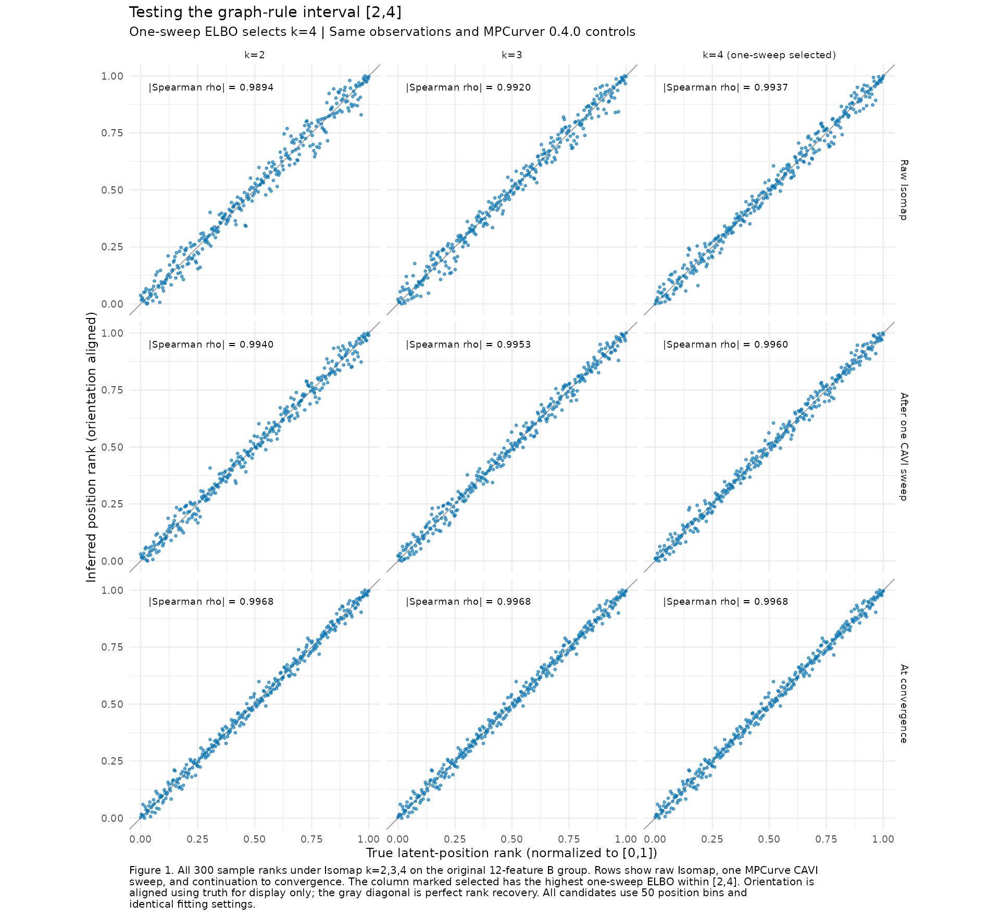

# Fitting the graph-rule interval [2,4]

All three Isomap starts in the graph-rule interval [2,4] recover the original
B ordering after MPCurve continuation. One-sweep ELBO selects k=4, whose final
absolute Spearman recovery is 0.996788, close to the earlier k=10 result
(0.996760). Thus the interval excludes the previously tested good k=5 through
11 starts while retaining other successful starts on this selected dataset.

The candidate set is k=2,3,4, obtained by adding a first-violation stopping
convention to the paper's degree heuristic. The paper's literal global-maximum
definition instead gives [2,299]; see [the graph diagnostic](literature_notes.md).
Observations, feature group, 50 position bins, RW2, quantile discretization,
adaptive noise/precision/position probabilities, seed, and stopping rule match
the [parent experiment](README.md). Package source remains MPCurver 0.4.0,
commit `f1511a013739ff4f754963e087466cdcedd910ea`. No observations were filtered
or standardized and all three graphs are connected.

Fit each candidate for exactly one CAVI sweep with `tol=0`, select by highest
one-sweep ELBO, and continue that saved state to normalized tolerance 1e-6.
The choice is recorded before any converged endpoint is available. Complete
the other two candidates only to evaluate the selection. Truth is used to
report recovery and align plots, not to select k or supply fitting coordinates.
The supplied B feature group remains a known group from simulation truth.

Table 1 compares the three new fits with the unchanged cached k=10 and k=15
results. Figure 1 displays the raw, one-sweep, and converged sample ranks.

Table 1. ELBOs and absolute Spearman recovery on the same 300-by-12 input.
The first three rows are new candidate fits; k=10 and k=15 are matched cached
controls from the parent experiment. Sweeps include the scoring sweep.

| k | One-sweep ELBO | Converged ELBO | Final recovery | Sweeps |
| ---: | ---: | ---: | ---: | ---: |
| 2 | -3916.291 | -3444.423 | 0.996796 | 176 |
| 3 | -3896.134 | -3442.384 | 0.996766 | 248 |
| **4 (selected)** | **-3885.004** | **-3442.608** | **0.996788** | **212** |
| 10 | -3875.176 | -3442.507 | 0.996760 | 168 |
| 15 | -4351.641 | -3626.589 | 0.758614 | 63 |

Raw Isomap recovery is already 0.989396, 0.991986, and 0.993716 for k=2,3,4,
respectively (Figure 1). The selected k=4 improves final ELBO over k=15 by
183.9811. Its final ELBO is 0.1010 below k=10 and 0.2237 below k=3, the highest
converged ELBO within [2,4]. All three starts recover the successful ordering;
the early score does not reproduce the exact endpoint ranking.



All three candidates converge without R fitting warnings or PCA fallback.
Objective traces are nondecreasing, preserve their one-sweep prefixes and
initialization metadata, and satisfy the final normalized stopping rule.
The selected resumed fit agrees with an uninterrupted public fit within
1.7e-10 in ELBO history and 2.7e-12 in the fitted state. Input and package-source
hashes match the parent experiment. Figure 1 was inspected for labels,
captions, and layout. This follow-up evaluates fit recovery; complete-pipeline
timing was not repeated for the narrower interval. Results concern one selected
dataset with a supplied feature group.

## Reproduction and outputs

From the InferOrder root, using the parent experiment's installed library:

```sh
BASH_ENV=/dev/null bash experiments/isomap_elbo_screen_v040/run_r.sh experiments/isomap_elbo_screen_v040/fit_narrow_range.R
BASH_ENV=/dev/null bash experiments/isomap_elbo_screen_v040/run_r.sh experiments/isomap_elbo_screen_v040/plot_narrow_range.R
```

`narrow_range.rds` saves all compact early/final states, the pre-endpoint choice,
warnings, continuation checks, controls, source/input/script hashes, and session
information. `narrow_range_summary.csv` contains every row of Table 1 without
rounding. PNG/PDF versions of Figure 1 and its plotted sample ranks are saved
as `narrow_positions.*` and `narrow_plotted_positions.csv`. Reconstructible full
fits are ignored under `full_fits/narrow_candidates.rds`; run logs are ignored.
The parent experiment's fits and timing measurements are preserved.
