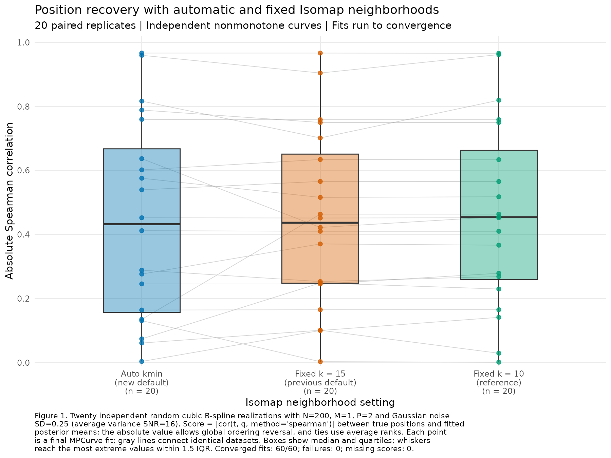

# Position recovery with automatic versus fixed Isomap neighborhoods

This internal simulation compares the new Isomap `k_min` default with the
previous fixed k=15 setting and a fixed k=10 reference. Twenty independent
nonmonotone curve pairs generate single-ordering datasets with 200 samples and
two signal features. All methods fit the same observations within a replicate,
using the same frozen MPCurver 0.4.0.9000 implementation and controls.

Median absolute Spearman correlations are 0.4320 (automatic), 0.4366 (k=15),
and 0.4539 (k=10). The mean paired automatic-minus-k=15 difference is -0.00710
with Monte Carlo SE 0.02534; automatic is higher on eleven replicates, lower on
eight, and tied on one.
This small simulation does not reproduce the clear improvement seen on the
preceding selected failure example. All sixty fits converge, with no fitting
warnings, failures, or PCA fallback.

## Design and position metric

Each feature is a cubic B-spline with eight random N(0,1) coefficients. Both
trajectories have positive and negative increments on a 2,001-point grid;
all twenty first draws meet this nonmonotonicity condition. Curve shapes,
Uniform(0,1) sample positions, and Gaussian observation noise are independently
generated across replicates. A common dense-grid scale sets average centered
signal variance to one, and observation-noise SD is 0.25 (average variance SNR
16). Shapes with intersections or close approaches are retained. M=1 is one
latent ordering and P=2 is the number of observed features. There is no grouping
or noise-only feature block. [DESIGN.md](DESIGN.md) contains the prespecified
controls and selection rules; [common.R](common.R) contains the generator.

The primary metric is absolute Spearman correlation between true sample
positions `t` and posterior-mean fitted positions `q`:

`abs(cor(t, q, method = "spearman"))`.

The absolute value allows global ordering reversal. Spearman uses the Pearson
correlation of ranks, assigning average ranks to tied positions. Truth enters
generation and evaluation only. The user corrected the requested metric from
cosine to Spearman after fitting; the same twenty inputs and sixty fits are
preserved. [DESIGN.md](DESIGN.md) retains the original prespecification, and
`historical_cosine/` retains the preceding report, numeric summaries, figure,
script versions, and provenance. [metrics.csv](metrics.csv) retains all three
metrics, with Spearman as `primary_score`.

Figure 1 contains all twenty repetitions for each setting. Table 1 describes
the marginal endpoint scores and Table 2 reports paired differences.



Table 1. Position recovery at convergence across twenty independent curve
realizations per setting. Absolute Spearman correlation allows global ordering
reversal and uses average ranks for ties. All sixty endpoints are included;
full ranges are saved in [summary.csv](summary.csv).

| Isomap setting | Median absolute Spearman | Mean absolute Spearman | First quartile | Third quartile |
| --- | ---: | ---: | ---: | ---: |
| Auto kmin | 0.431979 | 0.444307 | 0.156752 | 0.667365 |
| Fixed k=15 (previous default) | 0.436623 | 0.451408 | 0.247752 | 0.650927 |
| Fixed k=10 (reference) | 0.453890 | 0.461651 | 0.258879 | 0.662608 |

Table 2. Automatic-minus-fixed absolute Spearman differences on identical data.
Monte Carlo SE is the SD of the twenty paired differences divided by sqrt(20);
it describes simulation sampling variability. Improvements and declines use
a numerical tie tolerance of 1e-10. There are no missing pairs. These are
descriptive comparisons of this generator and noise level.

| Comparator | Mean paired difference | Median paired difference | Monte Carlo SE | Improvements | Ties | Declines |
| --- | ---: | ---: | ---: | ---: | ---: | ---: |
| Fixed k=15 | -0.007101 | 0.000514 | 0.025343 | 11/20 | 1/20 | 8/20 |
| Fixed k=10 | -0.017344 | -0.000602 | 0.023619 | 9/20 | 0/20 | 11/20 |

Automatic k values are 3 (ten replicates), 4 (eight), 5 (one), and 6 (one).
Every selected graph is connected and its immediately preceding neighborhood
is disconnected, verified independently using full pairwise distances.
Connectivity supplies a well-defined default; this experiment does not
establish that its smallest connected graph improves recovery across random
nonmonotone trajectories. No model is selected by ELBO or truth here.

## Fitting, provenance, and checks

All fits use fifty position bins, quantile initialization, RW2, initial
precision one, ridge zero, adaptive precision/noise/position probabilities,
and normalized ELBO tolerance 1e-6. Public fitting and continuation preserve
the actual posterior state, with up to 10,000 sweeps. The ordinary Isomap
landmark cap includes all 200 samples; the default graph-component and PCA
fallback policies are retained. In this run all sixty raw graphs are connected,
all samples are retained, and every actual initializer is Isomap.

Generating seeds are 202610020 plus replicate index; fitting seeds are
202620020 plus replicate index. Fit order is randomized with seed 202630020.
All twenty inputs independently regenerate exactly; dense-grid nonmonotonicity
and signal scaling pass verification. All sixty objective traces are
nondecreasing within numerical tolerance and meet their stopping rule. Saved
metrics and plotted data reproduce from the saved positions, with absolute
Spearman checked directly against R's rank correlation. The figure was visually
inspected. The installed package matches all 343 source function
bodies/formals; all 22 runtime source files match the frozen archive.
See [verification.txt](verification.txt).

The package base commit is `f1511a013739ff4f754963e087466cdcedd910ea`, plus the
local automatic-kmin implementation recorded by source hashes. The InferOrder
base commit is `f27f6dea06df526c53f34417eb0d23b438a08f21`. The frozen archive
is [source/MPCurver_0.4.0.9000.tar.gz](source/MPCurver_0.4.0.9000.tar.gz), SHA256
`65d226d224a02d37322f02fdcf2130d8be3255226f6f4ae917a8887345631a81`.
[provenance.rds](provenance.rds) records source/script/input settings and session
versions; [manifest.csv](manifest.csv) records seeds and observation hashes.

The initial verification's exact [0,1] endpoint check was corrected to allow
1e-12 floating-point tolerance: three replicate-13 posterior means exceed one
by at most 4.44e-16. Inputs, fits, and metrics were preserved. Original script
bytes and provenance remain in `source/experiment_scripts_at_first_run.tar.gz`
and `source/provenance_at_first_run.rds`; the current provenance records the
verification correction and both sets of script hashes.

The evaluation correction changes only `report.R` and `verify.R`, recorded in
`provenance.rds`. SHA256 checks against
`historical_cosine/input_fit_sha256.csv` confirm all twenty inputs and sixty
compact fit files are byte-identical to those used for the preceding report.

## Reproduction and artifacts

Run from the InferOrder repository root with R 4.3.3 and the dependency versions
listed in [R_session.txt](R_session.txt). The wrapper's `MPCURVE_R_BIN` setting
can override the local R executable.

```sh
BASH_ENV=/dev/null bash experiments/isomap_kmin_m1_p2_v040/run_r.sh install
BASH_ENV=/dev/null bash experiments/isomap_kmin_m1_p2_v040/run_r.sh experiments/isomap_kmin_m1_p2_v040/prepare.R
BASH_ENV=/dev/null bash experiments/isomap_kmin_m1_p2_v040/run_r.sh experiments/isomap_kmin_m1_p2_v040/run.R
BASH_ENV=/dev/null bash experiments/isomap_kmin_m1_p2_v040/run_r.sh experiments/isomap_kmin_m1_p2_v040/report.R spearman
BASH_ENV=/dev/null bash experiments/isomap_kmin_m1_p2_v040/run_r.sh experiments/isomap_kmin_m1_p2_v040/verify.R
```

`inputs/` retains curves, coefficients, true sample positions, standard-normal
noise, and observations. `results/` retains compact positions, parameters,
objective traces, graph counts, initialization provenance, statuses, and hashes
for all sixty fits. `plotted_scores.csv`, `paired_differences.csv`, and
`paired_summary.csv` retain plotted and paired data. A PDF version of Figure 1
is available as [position_spearman_boxplot.pdf](position_spearman_boxplot.pdf).
Reconstructible full fits, local libraries, and operational logs are explicitly
ignored. This work updates no package source or public workflowr page; no
commit or push was performed.

The [replicate-6 initialization diagnostic](initialization_diagnostic_rep06/README.md)
shows observed feature geometry, feature-by-feature scatter plots, and raw
Isomap positions for an outcome-selected automatic-kmin failure. It uses the
saved pre-fit coordinates and preserves the complete paired comparison.
