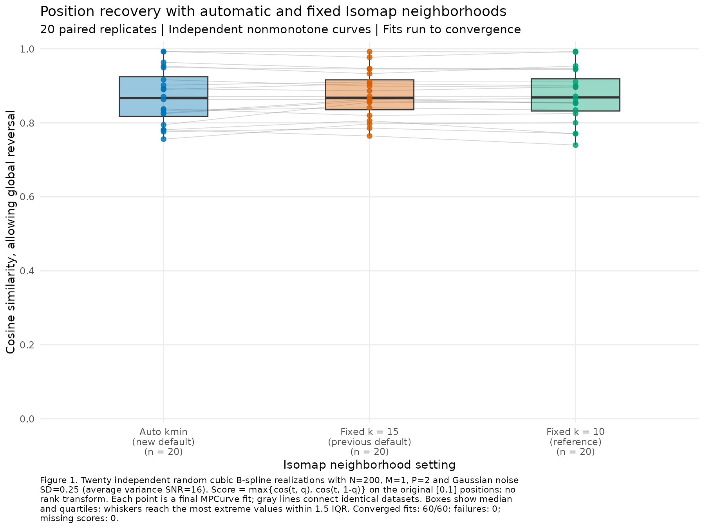

# Position recovery with automatic versus fixed Isomap neighborhoods

This internal simulation compares the new Isomap `k_min` default with the
previous fixed k=15 setting and a fixed k=10 reference. Twenty independent
nonmonotone curve pairs generate single-ordering datasets with 200 samples and
two signal features. All methods fit the same observations within a replicate,
using the same frozen MPCurver 0.4.0.9000 implementation and controls.

Median cosine similarities are 0.8671 (automatic), 0.8677 (k=15), and 0.8688
(k=10). The mean paired automatic-minus-k=15 difference is -0.00630 with Monte
Carlo SE 0.00515; automatic is higher on nine replicates and lower on eleven.
This small simulation does not reproduce the clear improvement seen on the
preceding selected failure example. All sixty fits converge, with no fitting
warnings, failures, or PCA fallback.

## Design and position metric

Each feature is a cubic B-spline with eight random N(0,1) coefficients. Both
trajectories have positive and negative increments on a 2,001-point grid;
all twenty first draws meet this nonmonotonicity condition. Curve shapes,
Uniform(0,1) sample positions, and Gaussian observation noise are independently
generated across replicates. A common dense-grid scale sets average centered
signal variance to one, and observation-noise SD is 0.25 (average variance SNR
16). Shapes with intersections or close approaches are retained. M=1 is one
latent ordering and P=2 is the number of observed features. There is no grouping
or noise-only feature block. [DESIGN.md](DESIGN.md) contains the prespecified
controls and selection rules; [common.R](common.R) contains the generator.

The reported cosine uses the true positions `t` and posterior-mean fitted
positions `q` directly, allowing a global reversal:

`max{sum(t*q)/(sqrt(sum(t^2))*sqrt(sum(q^2))),`
`sum(t*(1-q))/(sqrt(sum(t^2))*sqrt(sum((1-q)^2)))}`.

There is no centering, rank transform, or fitted monotone remapping in this
metric. Truth enters generation and evaluation only. The ordinary cosine has a
high positive baseline: the median score from a constant position of 0.5 is
0.8704 on these sampled truths. Thus scores near 0.87 alone do not imply good
ordering recovery. Table 1 includes absolute centered cosine (equal to absolute
Pearson correlation) and absolute Spearman correlation as secondary diagnostics.
The complete values are in [metrics.csv](metrics.csv).

Figure 1 contains all twenty repetitions for each setting. Table 1 describes
the marginal endpoint scores and Table 2 reports paired differences.



Table 1. Position recovery at convergence across twenty independent curve
realizations per setting. Ordinary cosine allows reversal of [0,1] fitted
positions; the secondary metrics allow a sign reversal after centering or
ranking. All sixty endpoints are included. Quartiles and full ranges are saved
in [summary.csv](summary.csv).

| Isomap setting | Median cosine | Mean cosine | Median absolute centered cosine | Median absolute Spearman |
| --- | ---: | ---: | ---: | ---: |
| Auto kmin | 0.867103 | 0.869948 | 0.404102 | 0.431979 |
| Fixed k=15 (previous default) | 0.867706 | 0.876245 | 0.451856 | 0.436623 |
| Fixed k=10 (reference) | 0.868791 | 0.873736 | 0.456718 | 0.453890 |

Table 2. Automatic-minus-fixed ordinary cosine differences on identical data.
Monte Carlo SE is the SD of the twenty paired differences divided by sqrt(20);
it describes simulation sampling variability. Improvements and declines use
a numerical tie tolerance of 1e-10. There are no missing pairs. These are
descriptive comparisons of this generator and noise level.

| Comparator | Mean paired difference | Median paired difference | Monte Carlo SE | Improvements | Declines |
| --- | ---: | ---: | ---: | ---: | ---: |
| Fixed k=15 | -0.006297 | -0.000462 | 0.005154 | 9/20 | 11/20 |
| Fixed k=10 | -0.003789 | -0.000475 | 0.005069 | 8/20 | 12/20 |

Automatic k values are 3 (ten replicates), 4 (eight), 5 (one), and 6 (one).
Every selected graph is connected and its immediately preceding neighborhood
is disconnected, verified independently using full pairwise distances.
Connectivity supplies a well-defined default; this experiment does not
establish that its smallest connected graph improves recovery across random
nonmonotone trajectories. No model is selected by ELBO or truth here.

## Fitting, provenance, and checks

All fits use fifty position bins, quantile initialization, RW2, initial
precision one, ridge zero, adaptive precision/noise/position probabilities,
and normalized ELBO tolerance 1e-6. Public fitting and continuation preserve
the actual posterior state, with up to 10,000 sweeps. The ordinary Isomap
landmark cap includes all 200 samples; the default graph-component and PCA
fallback policies are retained. In this run all sixty raw graphs are connected,
all samples are retained, and every actual initializer is Isomap.

Generating seeds are 202610020 plus replicate index; fitting seeds are
202620020 plus replicate index. Fit order is randomized with seed 202630020.
All twenty inputs independently regenerate exactly; dense-grid nonmonotonicity
and signal scaling pass verification. All sixty objective traces are
nondecreasing within numerical tolerance and meet their stopping rule. Saved
metrics and plotted data reproduce from the saved positions. The figure was
visually inspected. The installed package matches all 343 source function
bodies/formals; all 22 runtime source files match the frozen archive.
See [verification.txt](verification.txt).

The package base commit is `f1511a013739ff4f754963e087466cdcedd910ea`, plus the
local automatic-kmin implementation recorded by source hashes. The InferOrder
base commit is `f27f6dea06df526c53f34417eb0d23b438a08f21`. The frozen archive
is [source/MPCurver_0.4.0.9000.tar.gz](source/MPCurver_0.4.0.9000.tar.gz), SHA256
`65d226d224a02d37322f02fdcf2130d8be3255226f6f4ae917a8887345631a81`.
[provenance.rds](provenance.rds) records source/script/input settings and session
versions; [manifest.csv](manifest.csv) records seeds and observation hashes.

The initial verification's exact [0,1] endpoint check was corrected to allow
1e-12 floating-point tolerance: three replicate-13 posterior means exceed one
by at most 4.44e-16. Inputs, fits, and metrics were preserved. Original script
bytes and provenance remain in `source/experiment_scripts_at_first_run.tar.gz`
and `source/provenance_at_first_run.rds`; the current provenance records the
verification correction and both sets of script hashes.

## Reproduction and artifacts

Run from the InferOrder repository root with R 4.3.3 and the dependency versions
listed in [R_session.txt](R_session.txt). The wrapper's `MPCURVE_R_BIN` setting
can override the local R executable.

```sh
BASH_ENV=/dev/null bash experiments/isomap_kmin_m1_p2_v040/run_r.sh install
BASH_ENV=/dev/null bash experiments/isomap_kmin_m1_p2_v040/run_r.sh experiments/isomap_kmin_m1_p2_v040/prepare.R
BASH_ENV=/dev/null bash experiments/isomap_kmin_m1_p2_v040/run_r.sh experiments/isomap_kmin_m1_p2_v040/run.R
BASH_ENV=/dev/null bash experiments/isomap_kmin_m1_p2_v040/run_r.sh experiments/isomap_kmin_m1_p2_v040/report.R cosine
BASH_ENV=/dev/null bash experiments/isomap_kmin_m1_p2_v040/run_r.sh experiments/isomap_kmin_m1_p2_v040/verify.R
```

`inputs/` retains curves, coefficients, true sample positions, standard-normal
noise, and observations. `results/` retains compact positions, parameters,
objective traces, graph counts, initialization provenance, statuses, and hashes
for all sixty fits. `plotted_scores.csv`, `paired_differences.csv`, and
`paired_summary.csv` retain plotted and paired data. A PDF version of Figure 1
is available as [position_cosine_boxplot.pdf](position_cosine_boxplot.pdf).
Reconstructible full fits, local libraries, and operational logs are explicitly
ignored. This work updates no package source or public workflowr page; no
commit or push was performed.
