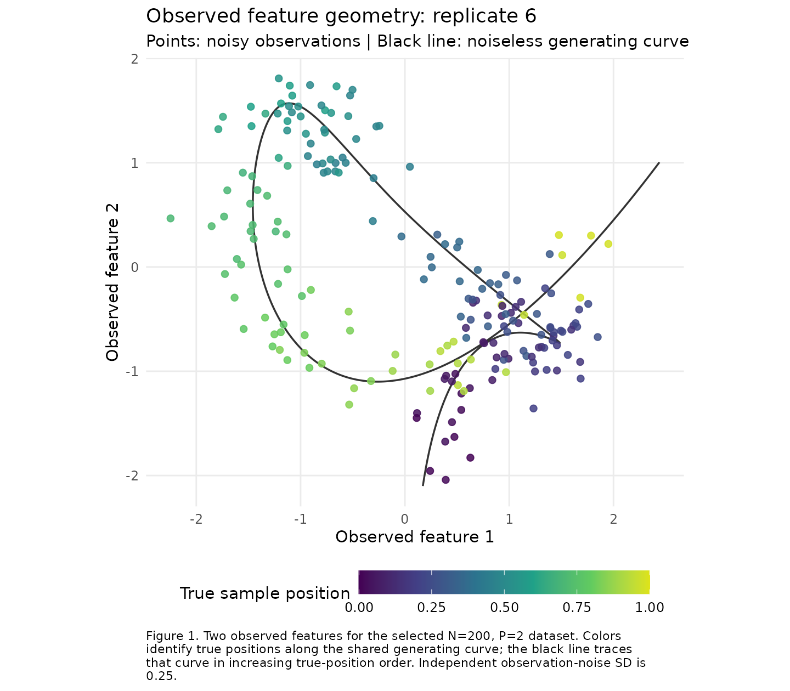
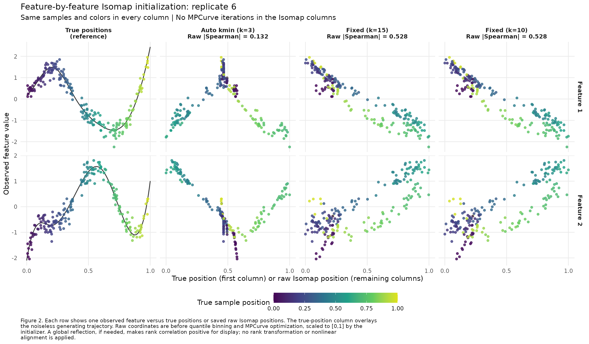
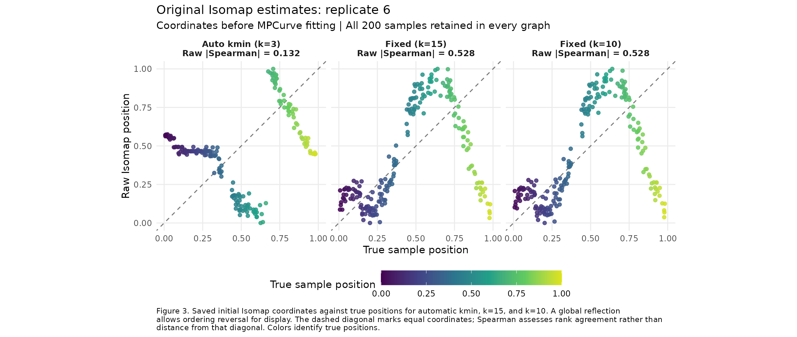

# Feature-level inspection of an automatic-kmin failure

This diagnostic shows the original Isomap positions for the same observations
under automatic kmin, k=15, and k=10. Replicate 6 has automatic k=3. Its raw
absolute Spearman correlation is 0.1318, versus 0.5278 and 0.5276 for the fixed
neighborhoods. The larger neighborhoods improve rank agreement but retain
folds in the initial coordinates. All three graphs are connected, retain all
200 samples, and use Isomap without PCA fallback.

The case is selected for illustration: among replicates with automatic final
absolute Spearman below 0.2, choose the largest difference between the mean
fixed-neighborhood final score and the automatic final score; ties use the
lowest replicate index. [case_selection.csv](case_selection.csv) records all
twenty candidates. This selection does not change the complete paired study.
The dataset has N=200, M=1, P=2, generating seed 202610026, fitting seed
202620026, and observation-noise SD 0.25. See the [parent report](../README.md)
for the generator and common fitting controls.

Table 1. Absolute Spearman correlations between true sample positions and
saved raw Isomap coordinates or converged MPCurve posterior means. Raw Isomap
coordinates precede quantile binning and all MPCurve iterations. All methods
use the same observations; numerical values are in [scores.csv](scores.csv).

| Setting | Actual k | Raw Isomap | Final MPCurve |
| --- | ---: | ---: | ---: |
| Auto kmin | 3 | 0.131801 | 0.134918 |
| Fixed k=15 | 15 | 0.527785 | 0.463390 |
| Fixed k=10 | 10 | 0.527590 | 0.463402 |

Figure 1 shows the observed feature geometry. Figure 2 compares each feature
against true positions and the three initial orderings. Figure 3 directly
compares the initial positions with truth. In Figures 1-3, colors identify
true positions. Figure 4 uses the same feature-plane coordinates in every
panel and colors points by the corresponding true or initial Isomap position.
For display, only the automatic coordinates are globally
reflected (q becomes 1-q), making their signed rank correlation positive;
the original coordinates and reflection flags are retained. No ranks or
nonlinear alignment replace the plotted coordinates.








## Reproduction and verification

Run from the InferOrder root:

```sh
BASH_ENV=/dev/null bash experiments/isomap_kmin_m1_p2_v040/run_r.sh experiments/isomap_kmin_m1_p2_v040/diagnose_initialization.R
BASH_ENV=/dev/null bash experiments/isomap_kmin_m1_p2_v040/run_r.sh experiments/isomap_kmin_m1_p2_v040/plot_feature_plane_initializations.R
```

[diagnose_initialization.R](../diagnose_initialization.R) loads the saved input
and raw/final coordinates, then generates the plots. The frozen MPCurver
0.4.0.9000 initializer independently reproduces all three saved initial vectors
within 1e-12. All raw and final metrics reproduce from the saved positions.
No MPCurve fitting is rerun. The three PNG figures were visually inspected.

[plot_feature_plane_initializations.R](../plot_feature_plane_initializations.R)
generates Figure 4 from the saved observations and raw Isomap positions.
All 800 plotted rows reproduce their source coordinates and color positions;
the PNG was visually inspected. Its plotted data and provenance are saved in
[plotted_feature_plane_points.csv](plotted_feature_plane_points.csv) and
[feature_plane_provenance.rds](feature_plane_provenance.rds).

[sample_coordinates.csv](sample_coordinates.csv) retains raw, final, and
display coordinates alongside the observed features;
[plotted_feature_points.csv](plotted_feature_points.csv) retains all 1,600
points in Figure 2; [true_curve.csv](true_curve.csv) retains the generating
curve. [provenance.rds](provenance.rds) records selection, seeds, input/fit/script
SHA256 hashes, and parent source provenance. [verification.txt](verification.txt)
records the numerical checks. PDF copies accompany each PNG.
