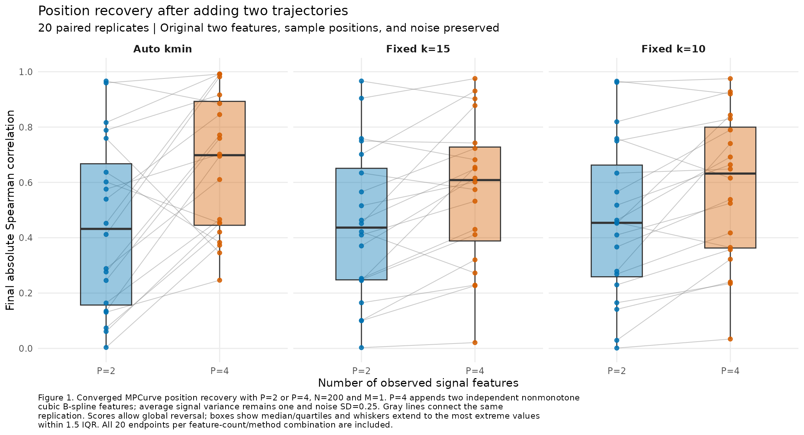
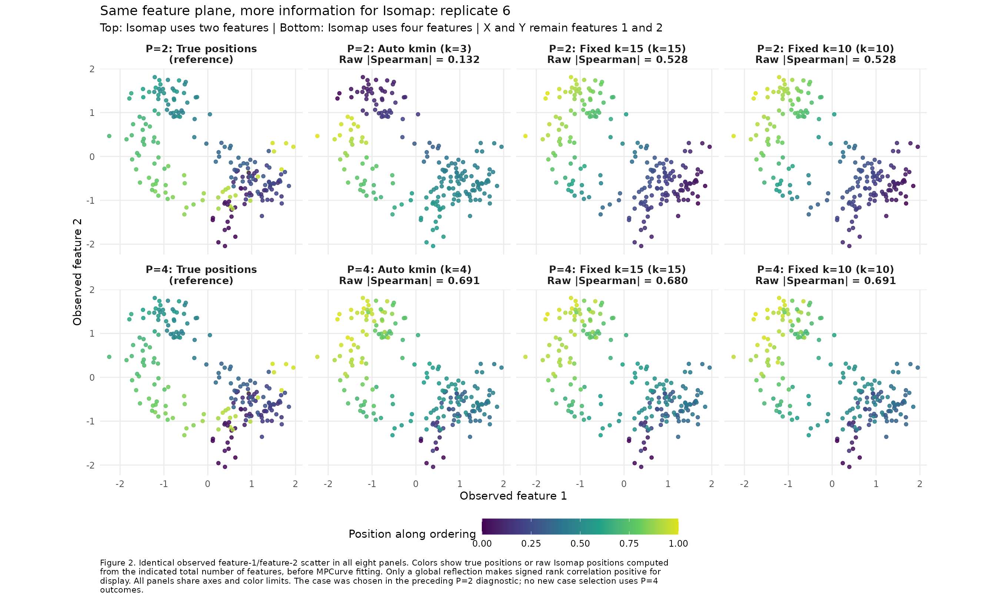
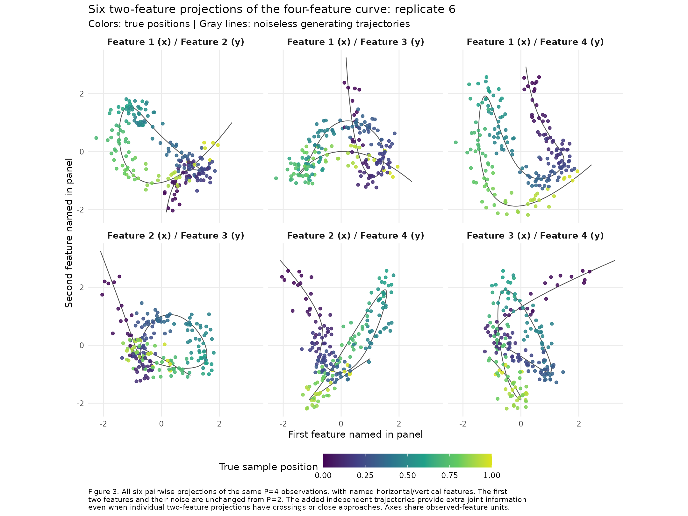

# Position recovery after adding two nonmonotone trajectories

This internal experiment tests whether two additional observed trajectories
improve position recovery when a two-feature curve has intersections or close
approaches. Each of the twenty P=2 datasets is extended to P=4 while preserving
its true sample positions, first two trajectories, and exact original noise.
All settings use N=200, M=1, noise SD 0.25, and the same frozen MPCurver
0.4.0.9000 implementation and fitting controls.

The automatic-kmin median final absolute Spearman correlation increases from
0.4320 to 0.6984, with improvement in sixteen of twenty pairs. Within P=4,
automatic recovery is higher than each fixed neighborhood in seventeen of
twenty replicates. Adding trajectories improves this experiment's recovery;
substantial errors remain in some datasets. This design adds both geometric
and likelihood information and does not separately measure the effect of
removing individual crossings. All sixty new fits converge without fitting
warnings, failures, or PCA fallback.

## Paired scores

The endpoint is `abs(cor(true_positions, fitted_positions, method="spearman"))`,
where fitted positions are posterior means. Absolute values allow global
ordering reversal, and ties use average ranks. All twenty replicates enter
every comparison. Figure 1 shows the paired endpoint scores summarized in
Table 1. Raw initialization comparisons are also retained in
[paired_dimension_summary.csv](paired_dimension_summary.csv).

Table 1. Final absolute Spearman recovery after adding two features on the same
samples. Paired differences are P=4 minus P=2; Monte Carlo SE is the SD of
twenty paired differences divided by sqrt(20). Improvements use a numerical
tie tolerance of 1e-10. There are no missing pairs.

| Isomap setting | P=2 median | P=4 median | Mean paired difference | Monte Carlo SE | Improvements |
| --- | ---: | ---: | ---: | ---: | ---: |
| Auto kmin | 0.431979 | 0.698366 | 0.219791 | 0.063075 | 16/20 |
| Fixed k=15 | 0.436623 | 0.608411 | 0.117098 | 0.033881 | 15/20 |
| Fixed k=10 | 0.453890 | 0.631958 | 0.122245 | 0.033354 | 17/20 |



Within P=4, the mean automatic-minus-k=15 difference is 0.095592 (Monte Carlo
SE 0.034331), and automatic-minus-k=10 is 0.080202 (SE 0.034821). Each comparison
has seventeen improvements and three declines. See [paired_summary.csv](paired_summary.csv)
for the within-P=4 comparison and [metrics.csv](metrics.csv) for every endpoint.
These are descriptive comparisons for this generator and noise level.
Automatic k values are 3 (eleven replicates), 4 (six), 5 (one), 6 (one), and
8 (one), independently verified as the smallest connected neighborhoods.

## The previously inspected example

Replicate 6 is retained from the preceding P=2 inspection, with no selection
using P=4 outcomes. Automatic k changes from 3 to 4. Its raw Isomap absolute
Spearman rises from 0.1318 to 0.6909 and its final score from 0.1349 to 0.6947.
Figure 2 keeps the identical feature-1/feature-2 observations on the axes while
using true or raw Isomap positions for color. The bottom row computes Isomap
from all four features. Table 2 reports both initial and final scores.

Table 2. Initial and final absolute Spearman correlations in replicate 6,
holding the original observations fixed. Initial scores precede quantile
binning and all MPCurve iterations. Every graph retains all 200 samples.

| Setting | P=2 k | P=4 k | P=2 raw Isomap | P=4 raw Isomap | P=2 final | P=4 final |
| --- | ---: | ---: | ---: | ---: | ---: | ---: |
| Auto kmin | 3 | 4 | 0.131801 | 0.690937 | 0.134918 | 0.694690 |
| Fixed k=15 | 15 | 15 | 0.527785 | 0.679827 | 0.463390 | 0.649026 |
| Fixed k=10 | 10 | 10 | 0.527590 | 0.691373 | 0.463402 | 0.691772 |



Figure 3 shows all six two-feature projections, colored by truth. A crossing
in one projection can be separated by another feature. The relevant ambiguity
is whether the same pair of positions is close across all four observations;
individual pairwise projection crossings need not disappear.



Figure 4 arranges these feature pairs as a scatterplot matrix. Columns specify
horizontal features and rows specify vertical features. The lower triangle
shows noisy observations; the upper triangle shows noiseless generating
curves, both colored by true positions. Features 1 and 2 are the original
pair, and features 3 and 4 are the added trajectories.


## Generator, fitting, and verification

New features use cubic B-splines with eight normal coefficient draws, matching
the parent basis. Both must be nonmonotone on the same 2,001-point grid. Only
generator-condition failures would be redrawn; all twenty first added pairs
qualify. The added pair is centered and shares a scale fixing its average
signal variance to one. The original pair retains its scale, so all four
features also have average signal variance one and average variance SNR 16.
Observation variances are not standardized. Seeds for new trajectories/noise
are 202640020 plus replicate index. Parent generating seeds, true positions,
and coefficient/signal/noise arrays are retained in the complete inputs.

Fits use 50 position bins, quantile initialization, RW2, ridge zero, initial
precision one, adaptive position weights, learned precision/noise, and
normalized ELBO tolerance 1e-6. Fitting seeds and randomized method order match
the parent study. Public continuation preserves actual states within the
prespecified 10,000-sweep budget. All new fits converge. The default Isomap
landmark cap uses all samples; all graphs are connected and retain every row.
[DESIGN.md](DESIGN.md) records the design before added-feature generation/fitting.

Verification exactly regenerates twenty new inputs, confirms bitwise equality
of their first two observations/signals/errors and true positions with the
parents, validates nonmonotonicity and signal variance, reproduces raw/final
metrics, checks objective traces and stopping rules, and independently checks
twenty minimum-connected graphs using pairwise distances. All 343 installed
function bodies/formals match the runtime source. The new paired plot contains
all 120 endpoints, and replicate-6 scatter data retain all 1,600 displayed
points. All three comparison PNGs were visually inspected. See
[verification.txt](verification.txt), [verification.rds](verification.rds), and
[report_verification.txt](report_verification.txt).

The frozen [package archive](source/MPCurver_0.4.0.9000.tar.gz) has SHA256
`65d226d224a02d37322f02fdcf2130d8be3255226f6f4ae917a8887345631a81`, identical
to the parent archive. The package base is `f1511a013739ff4f754963e087466cdcedd910ea`
with the local automatic-kmin implementation recorded by source hashes;
InferOrder base is `f27f6dea06df526c53f34417eb0d23b438a08f21`.
[provenance.rds](provenance.rds), [manifest.csv](manifest.csv), and
[R_session.txt](R_session.txt) retain versions, source/script/parent hashes,
seeds, and settings. All parent study artifacts remain byte-identical to
[source/parent_files_at_start.csv](source/parent_files_at_start.csv).

## Reproduction

Run from the InferOrder root with the parent inputs/results available:

```sh
BASH_ENV=/dev/null bash experiments/isomap_kmin_m1_p4_v040/run_r.sh install
BASH_ENV=/dev/null bash experiments/isomap_kmin_m1_p4_v040/run_r.sh experiments/isomap_kmin_m1_p4_v040/prepare.R
BASH_ENV=/dev/null bash experiments/isomap_kmin_m1_p4_v040/run_r.sh experiments/isomap_kmin_m1_p4_v040/run.R
BASH_ENV=/dev/null bash experiments/isomap_kmin_m1_p4_v040/run_r.sh experiments/isomap_kmin_m1_p4_v040/report.R spearman
BASH_ENV=/dev/null bash experiments/isomap_kmin_m1_p4_v040/run_r.sh experiments/isomap_kmin_m1_p4_v040/compare_p2_p4.R
BASH_ENV=/dev/null bash experiments/isomap_kmin_m1_p4_v040/run_r.sh experiments/isomap_kmin_m1_p4_v040/verify.R
BASH_ENV=/dev/null bash experiments/isomap_kmin_m1_p4_v040/run_r.sh experiments/isomap_kmin_m1_p4_v040/plot_scatter_matrix.R
```

`inputs/` and `results/` retain complete data and compact fits. Comparison CSVs
retain scores, paired differences, and plotted data; PDF copies accompany the
PNGs. Local libraries, reconstructible full fits, and operational logs are
explicitly ignored. No package source/default, public page, commit, or push
changes in this experiment.

[plot_scatter_matrix.R](plot_scatter_matrix.R) produces Figure 4 directly from
the saved replicate-6 input. Its 1,200 observed points and 12,006 curve-grid
points are retained in [rep06_scatter_matrix_observed.csv](rep06_scatter_matrix_observed.csv)
and [rep06_scatter_matrix_curves.csv](rep06_scatter_matrix_curves.csv).
[rep06_scatter_matrix_provenance.rds](rep06_scatter_matrix_provenance.rds) records
the input/script SHA256 hashes and parent settings. Every observed coordinate
and color value matches its source observation/true position; the PNG was
visually inspected. This additional figure reruns no simulations or fits.

[Noise reduction on replicate 6](noise_sensitivity_rep06/README.md) holds the
same four signals, sample positions, and errors fixed while reducing noise SD
from 0.25 to 0.10, 0.05, and 0.01. It retains all three neighborhood settings,
raw/final scores, feature-plane comparisons, and a noiseless graph diagnostic.
