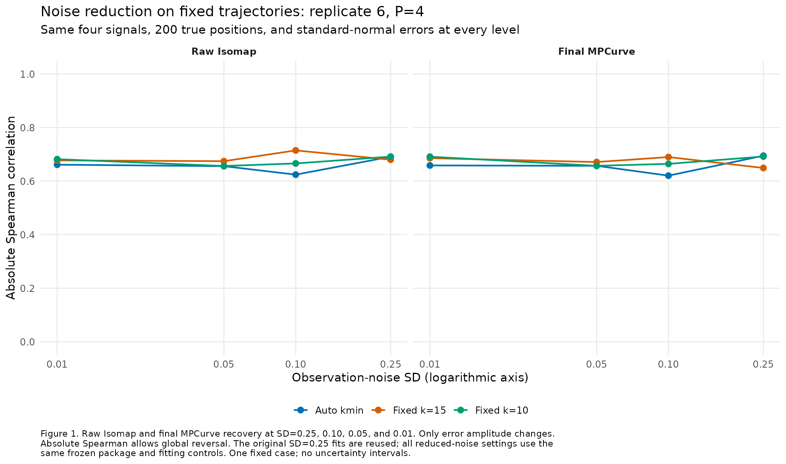
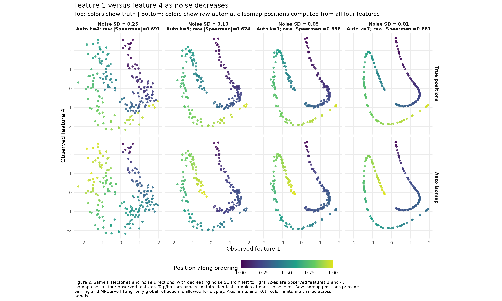

# Noise reduction on the four-feature inspection case

This internal check fixes replicate 6's four signals, 200 true positions,
and standard-normal errors and reduces only observation-noise SD.
Automatic kmin does not recover the ordering as noise decreases: raw absolute
Spearman changes from 0.690937 at SD 0.25 to 0.661274 at SD 0.01, and final
MPCurve recovery from 0.694690 to 0.658473. Fixed k=15 and k=10 also stay
below 0.72 across these levels. All twelve fits converge without initializer
or fitting warnings, dropped samples, or PCA fallback.

## Initial and final recovery

The endpoint is absolute Spearman between true positions and either raw
Isomap coordinates or final posterior-mean MPCurve positions. Absolute values
allow global reversal; ties use average ranks. Raw scores precede quantile
binning and all model iterations. Table 1 and Figure 1 include every setting.
This is one fixed dataset, with no replication-based uncertainty intervals.

Table 1. Position recovery in replicate 6, N=200, M=1, P=4. Automatic kmin
is recomputed from all four observed features at each noise level. The three
SD 0.25 fits are reused byte-for-byte; the other nine fits are new.

| Noise SD | Setting | k used | Raw Isomap | Final MPCurve | Sweeps |
| ---: | --- | ---: | ---: | ---: | ---: |
| 0.25 | Auto kmin | 4 | 0.690937 | 0.694690 | 60 |
| 0.25 | Fixed k=15 | 15 | 0.679827 | 0.649026 | 61 |
| 0.25 | Fixed k=10 | 10 | 0.691373 | 0.691772 | 119 |
| 0.10 | Auto kmin | 5 | 0.624134 | 0.620347 | 93 |
| 0.10 | Fixed k=15 | 15 | 0.714612 | 0.689765 | 73 |
| 0.10 | Fixed k=10 | 10 | 0.665927 | 0.664341 | 45 |
| 0.05 | Auto kmin | 7 | 0.655711 | 0.657093 | 41 |
| 0.05 | Fixed k=15 | 15 | 0.674360 | 0.671146 | 27 |
| 0.05 | Fixed k=10 | 10 | 0.656410 | 0.657093 | 40 |
| 0.01 | Auto kmin | 7 | 0.661274 | 0.658473 | 19 |
| 0.01 | Fixed k=15 | 15 | 0.677289 | 0.685638 | 27 |
| 0.01 | Fixed k=10 | 10 | 0.681832 | 0.691110 | 24 |



Figure 2 uses observed feature 1 and feature 4 on its axes. The top row uses
true positions for color; the bottom uses automatic Isomap computed from all
four features. Both rows show identical observations at each SD. Only global
reflection is used to orient the bottom-row colors.



## Graph inspection

A post hoc initializer-only noiseless diagnostic uses the same sampled
signals at SD zero. Automatic kmin is 6 and raw absolute Spearman is 0.617511.
Its graph contains an edge between true positions 0.196860 and 0.981533:
ranks 46 and 200 of 200 samples. The four-feature Euclidean edge length is
1.4050; following consecutive samples in true order gives a path length of
14.6792. At SD 0.01, an edge joins positions 0.209671 and 0.981533. These
connections join distant parts of the sampled trajectory even with little
or no noise. Connectivity alone does not enforce local movement along the
true curve.

Embedding the noiseless path connecting only consecutive true ranks gives
absolute Spearman 1. This diagnostic control uses truth to construct its
graph; it is not an estimated initializer or a MPCurve fit. These results
identify a graph problem in this case and do not estimate how frequently
noise reduction helps other trajectories.

Independent full-distance graphs reproduce package shortest-path distances
and all four saved automatic coordinate vectors within 1e-12. All five kmin
values are independently verified as the smallest connected neighborhoods.
[graph_summary.csv](graph_summary.csv), [graph_edges.csv](graph_edges.csv), and
[graph_components.csv](graph_components.csv) retain graph sizes, all unique
edges with truth/rank/path separations, and component counts for k=1 through
kmin. [noiseless_diagnostic_positions.csv](noiseless_diagnostic_positions.csv)
retains noiseless and oracle positions. Settings and hashes are recorded in
[graph_diagnostic_provenance.rds](graph_diagnostic_provenance.rds).

Figure 3 shows the exact neighborhood graphs at kmin-1 and kmin for SD 0.25,
0.01, and zero, using feature 1 and feature 4 for layout. Neighbors are chosen
from all four features. This implementation uses undirected union-kNN:
either sample selecting the other is enough to retain an edge. Projected
edge crossings do not create graph connections. Nodes keep their kmin-1
component colors in both rows, with component labels restarting per column.
Red edges connect different kmin-1 components; rings mark their endpoints.


Table 2. Connected components and the unique edges joining different preceding
components when k increases by one. Graphs use four-feature Euclidean distance
and exactly match the frozen package's neighbor edge sets.

| Noise SD | kmin-1 | Components before | kmin | Components after | Connecting edges added |
| ---: | ---: | ---: | ---: | ---: | ---: |
| 0.25 | 3 | 2 | 4 | 1 | 1 |
| 0.01 | 6 | 2 | 7 | 1 | 2 |
| 0.00 | 5 | 3 | 6 | 1 | 2 |

In the noiseless graph, the sample at position 0.981533 selects the sample at
0.196860 as its sixth neighbor. The reverse selection has rank 64. Union-kNN
therefore includes this edge at k=6, linking two formerly separate components.
The other connecting edge joins positions 0.556594 and 0.579310.
[knn_graph_connecting_edges.csv](knn_graph_connecting_edges.csv) retains all
five highlighted edges, including neighbor rank in each direction.
[knn_graph_nodes.csv](knn_graph_nodes.csv), [knn_graph_edges.csv](knn_graph_edges.csv),
and [knn_graph_summary.csv](knn_graph_summary.csv) retain all six plotted graphs;
[knn_graph_provenance.rds](knn_graph_provenance.rds) records the script/source
hashes, exact package edge-set comparisons, and preserved source artifacts.
The PNG was visually inspected. No inputs, initializers, or fits were changed.
Independent checks of plotted endpoints, nested edge sets, and connectivity
after removing the highlighted edges are in [knn_graph_verification.txt](knn_graph_verification.txt).

The blue shortcut endpoint has six blue nearest neighbors, at four-feature
distances 0.073144 through 0.132553. It ranks the green endpoint 64th and does
not select that edge. Figure 4 separates the two directed neighbor lists:
the green endpoint selects five green neighbors followed by the blue point
at rank 6. The union graph retains that one-sided selection. Every other
sample is included as a candidate, with self excluded; distances use the
four noiseless feature values. Both six-neighbor lists match the frozen
package's nearest-neighbor helper exactly.


Table 3. Six nearest neighbors of the green endpoint at true position
0.981533, ordered by four-feature Euclidean distance. Component colors refer
to Figure 3's noiseless k=5 graph.

| Neighbor rank | Sample | True position | Component color | Four-feature distance |
| ---: | ---: | ---: | --- | ---: |
| 1 | 83 | 0.978704 | Green | 0.137102 |
| 2 | 185 | 0.977297 | Green | 0.203820 |
| 3 | 56 | 0.976916 | Green | 0.221714 |
| 4 | 98 | 0.964953 | Green | 0.748090 |
| 5 | 8 | 0.948650 | Green | 1.359894 |
| 6 | 96 | 0.196860 | Blue | 1.404997 |

[shortcut_neighbor_audit.csv](shortcut_neighbor_audit.csv) retains all 199
candidates for each query, four-feature coordinate differences, distances,
and ranks in four dimensions and the plotted two-dimensional projection.
[shortcut_six_neighbors.csv](shortcut_six_neighbors.csv) retains the twelve
selected neighbors, and [shortcut_neighbor_plot_points.csv](shortcut_neighbor_plot_points.csv)
retains all background points. Source/script hashes and package checks are in
[shortcut_neighbor_provenance.rds](shortcut_neighbor_provenance.rds). The PNG
was visually inspected; no input, graph, initialization, or fit changes.
Independent candidate-distance, rank, and directional-selection checks are in
[shortcut_neighbor_verification.txt](shortcut_neighbor_verification.txt).

## Settings and verification

[DESIGN.md](DESIGN.md) specifies the four-level comparison before fitting.
Observations are `signal + noise_sd * standard_noise`, without standardizing
observed features. Average dense-grid signal variance stays one; variance
SNRs are 16, 100, 400, and 10000. No signals, positions, or errors are redrawn.

The frozen parent MPCurver 0.4.0.9000 implementation and seed 202620026 use
fifty bins, quantile initialization, RW2, ridge zero, adaptive precision/noise/
position weights, normalized ELBO tolerance 1e-6, and a 10000-sweep budget.
[provenance.rds](provenance.rds) retains parent package/source hashes, seeds,
commits, complete settings, source input/fit hashes, and pre-fit design/script
hashes.

Verification reproduces all 24 raw/final correlations, validates twelve ELBO
traces and stopping rules, confirms fixed signals/positions/errors, and checks
minimum connectivity independently. Parent input and three source fits retain
their original file hashes. Plot data contain 1600 feature points and 24
scores. Both PNGs were visually inspected, including corrected color-bar
spacing. See [verification.txt](verification.txt), [verification.rds](verification.rds),
and [report_verification.txt](report_verification.txt).

## Reproduction

From the InferOrder root, with the parent frozen library installed:

```sh
BASH_ENV=/dev/null bash experiments/isomap_kmin_m1_p4_v040/run_r.sh experiments/isomap_kmin_m1_p4_v040/noise_sensitivity_rep06/run.R
BASH_ENV=/dev/null bash experiments/isomap_kmin_m1_p4_v040/run_r.sh experiments/isomap_kmin_m1_p4_v040/noise_sensitivity_rep06/diagnose_graph.R
BASH_ENV=/dev/null bash experiments/isomap_kmin_m1_p4_v040/run_r.sh experiments/isomap_kmin_m1_p4_v040/noise_sensitivity_rep06/verify_report.R
BASH_ENV=/dev/null bash experiments/isomap_kmin_m1_p4_v040/run_r.sh experiments/isomap_kmin_m1_p4_v040/noise_sensitivity_rep06/plot_knn_graph.R
BASH_ENV=/dev/null bash experiments/isomap_kmin_m1_p4_v040/run_r.sh experiments/isomap_kmin_m1_p4_v040/noise_sensitivity_rep06/inspect_shortcut_neighbors.R
```

Existing inputs and fits are checked and reused on rerun. Each `sd_*/inputs/`
and `sd_*/results/` directory retains data and compact fits. Plot CSVs and PDFs
accompany the figures. `diagnose_graph.R` also rebuilds Figure 2 from saved
data with a wider color bar; no fit changes. Full fits and logs are explicitly
ignored. No package/default or public page changes.
