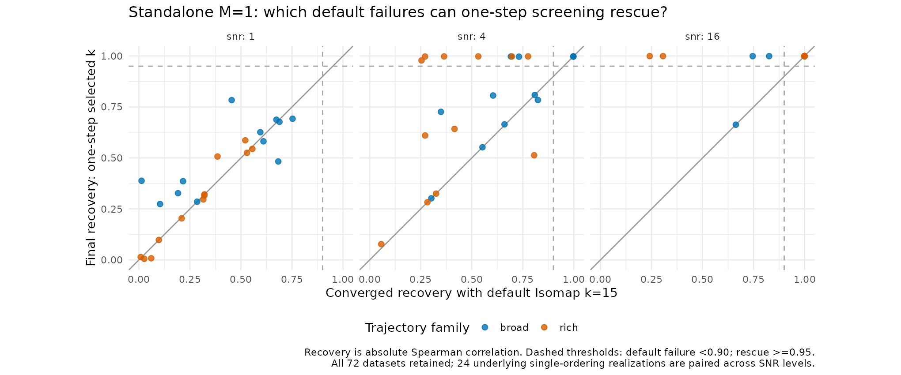
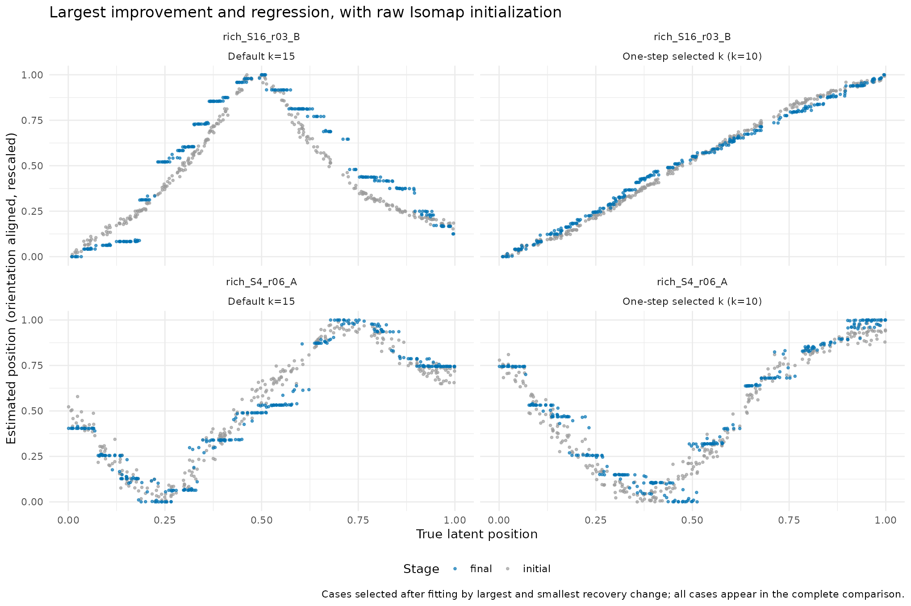

# Standalone M=1: rescue of default Isomap failures

This study removes feature grouping and multiple-ordering inference. Each of the 72 single-ordering matrices from the preceding M2 experiment is analyzed independently, with 300 samples and 12 random smooth trajectories. All data are retained, including easy cases and failures. These are 24 underlying single-ordering realizations paired across SNR 1, 4, and 16; reusing the previous data provides a controlled simplification, not independent validation.

For each matrix, Isomap k=5,10,15,20,30 generates candidate initializations. Exactly one single-ordering MPCurve CAVI sweep scores each candidate by ELBO, and the highest score chooses k (smallest k breaks exact ties). K=50 grid positions and all fitting controls remain fixed. The chosen candidate and default k=15 are each fit to convergence from their raw initializations. Every other connected candidate is also fit to convergence, solely to measure the oracle rescue ceiling. Truth and converged candidate results never enter the one-step selection rule.

The primary denominator is a default k=15 *converged* recovery below 0.90, measured by absolute Spearman correlation with the true latent position. A rescue requires selected recovery >=0.95. We separately count raw Isomap failures and repairs achieved by ordinary default iterations. A regression is a recovery decrease greater than 0.05.

See `DESIGN.md` for the design fixed before fitting, `summary.csv` for counts by SNR, `pairs.csv` for every dataset, and `candidates.csv` for all initial, one-step and converged candidate recoveries and one-step ELBOs. All convergence and input/source-hash checks are performed by `summarize.R`. `results/` retains positions, objective traces, input hashes, source hashes, and package version.

## Results

| SNR | Default failures | One-step rescues | Rescue fraction | Oracle rescues among these candidates |
| --- | ---: | ---: | ---: | ---: |
| 1 | 24 | 0 | 0% | 0 |
| 4 | 21 | 8 | 38.1% | 8 |
| 16 | 5 | 4 | 80% | 4 |
| All | 50 | 12 | 24% | 12 |

The same 50 cases failed at raw default Isomap initialization and after default convergence. Ordinary default iterations rescued none to >=0.95. One-step screening recovered every case that any of the five converged candidates could rescue at the prespecified threshold. The remaining 38 failures were not rescued by any tested candidate. This is a finite candidate-set ceiling under the stated optimizer, not an information-theoretic impossibility result.

All 12 rescues were also achievable by fixed k=5. Consequently these data do not establish an advantage of adaptive screening over simply reducing k for the broken cases. Two k=5 graphs on otherwise easy high-SNR datasets were disconnected and excluded; a complete fixed-k=5 deployment comparison would require a specified fallback.

There were 23 improvements and 4 regressions greater than 0.05, with no default recovery >=0.95 falling below 0.90. Average recovery was 0.6105 versus 0.7127. The largest rescue was rich_S16_r03_B, 0.2413 -> 0.9995; the largest regression was rich_S4_r06_A, 0.8057 -> 0.5132. These examples are selected by the observed extremes, not as representative cases.




Screening all five candidates cost a median 0.433 seconds, including 0.058 seconds of CAVI scoring. Median default and selected pipeline times were 0.454 and 0.861 seconds; the median paired increase was 0.376 seconds, and the median paired ratio was 1.878. Absolute overhead is small, but relative overhead is substantially higher than in the M2 joint-fitting study because standalone fits are much cheaper.

All 358 connected candidate fits converged; two of 360 candidate graphs were disconnected (broad_S16_r06_B and rich_S16_r04_B, both k=5). Input/source hashes and the score-maximization rule passed verification. Both rendered figures were visually inspected. The session-information command emitted an environment-only timezone warning after analysis completed.

## Reproduction

From the InferOrder root, using the frozen MPCurver 0.3.4 library and R 4.3.3 wrapper:

```sh
BASH_ENV=/dev/null bash experiments/estimate_intrinsic_m_smooth_v032/run_r.sh experiments/m1_local_k_v034/run.R $(seq 1 36)
BASH_ENV=/dev/null bash experiments/estimate_intrinsic_m_smooth_v032/run_r.sh experiments/m1_local_k_v034/summarize.R
```

The source inputs and generator are in `../m2_local_k_v034/`. Source package commit: `15f2b0bbe5dfa61cd46da5160b2bc251e75a0475`; archive SHA256: `58d0c99c6170994c82eedba190fb1c28a63eb47530c575705323c3cf3992b7c6`. The shared `local_fit` helper specifies second-order random-walk smoothing, ridge 0, initial lambda 1, quantile discretization, and relative convergence tolerance 1e-6. Full fits initially allow 2000 sweeps, extended if necessary. Existing endpoint files are skipped on rerun. No website or package sources are modified.

Timings account for all embeddings and one-step scores plus fitting only the selected candidate. The oracle's other converged fits are research diagnostics and are excluded from the deployable selector's cost. Embeddings and candidate fits are measured once and shared in the comparison; this is descriptive component accounting, not a replicated runtime benchmark.
