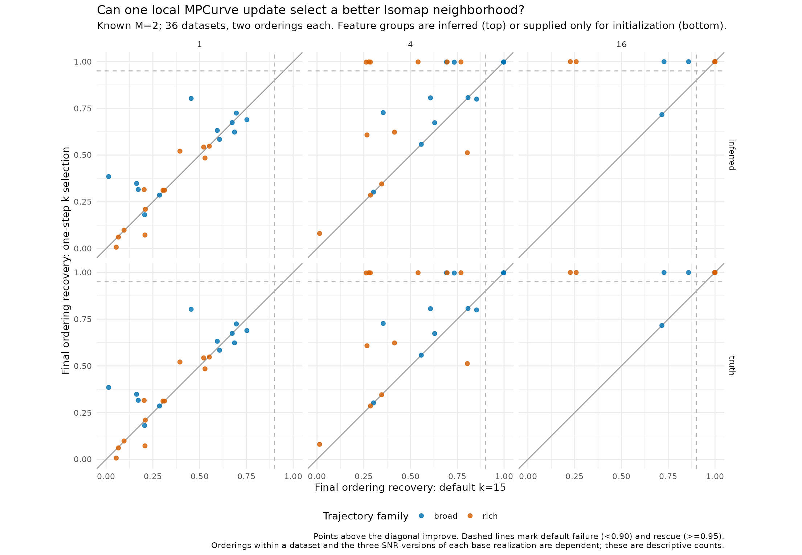
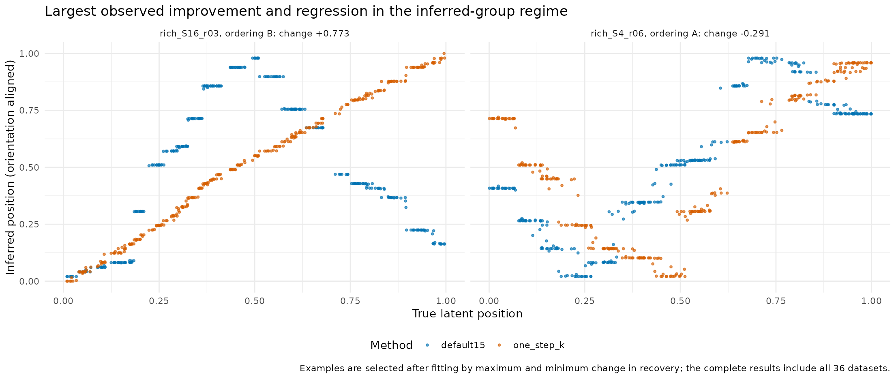
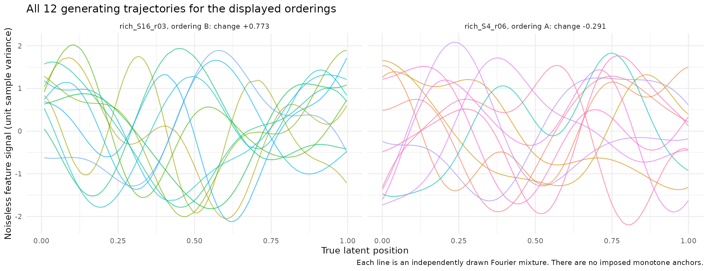
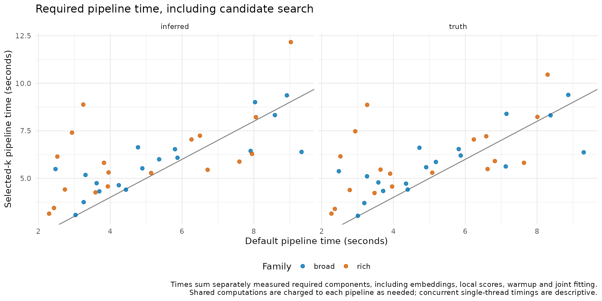

# One-step local selection of Isomap neighbors with known M=2

Can one single-ordering MPCurve update select a useful Isomap neighborhood before fitting the full model? In this exploratory study, local ELBO screening rescued 12 of 50 default initialization failures across 72 orderings, with a median paired pipeline-time increase of 12.7%. It selected a strongly recovering candidate whenever one was present, but many noisy datasets had no such candidate. This supports inexpensive initialization screening, rather than a general solution to ordering recovery.

## Design and comparison

The design was fixed before the simulation runs; see [DESIGN.md](DESIGN.md). Twelve independent base realizations (six each from two trajectory families) were evaluated at SNR 1, 4, and 16, producing 36 datasets. Each dataset has 300 samples and 24 features, split between two independent latent orderings. Every feature is an independent random sine/cosine mixture with unit sample variance. The broad family uses angular frequencies pi times 2:4 with frequency^-2 attenuation; the rich family uses 2:6 with frequency^-1.5 attenuation. There are no imposed monotone anchors, trajectory shape constraints, or outcome-based resampling. This is a particular family of random smooth curves, not unrestricted functions. Signal, latent positions, and unit Gaussian noise are paired across SNR levels.

The primary analysis knows M=2 and estimates feature groups using spline-R2 similarity (df=5), single-linkage clustering, and a two-group cut. For each group separately, the selector constructs Isomap orderings at k=5,10,15,20,30, runs exactly one single-ordering CAVI sweep, and chooses the largest local ELBO; exact ties favor the smaller k. Disconnected/nonfinite candidates are excluded. The grid size K=50 remains fixed: the selected quantity is the Isomap neighborhood k, not M or the latent grid size.

The baseline uses Isomap k=15 on the identical groups. Both arms then use the same two-sweep local warmup and full joint MPCurve convergence protocol, learning trajectories, noise, smoothness, and assignments. The selected arm reruns the standard warmup from its chosen raw ordering, isolating the effect of choosing k. A second diagnostic supplies the true feature groups only at initialization. All inferred groups were correct (ARI=1), so its recovery results duplicate the primary analysis and provide no additional independent evidence. All 144 joint fits converged, retained two occupied slots, and ended with ARI=1; no fallback initializer or joint-fit warning was needed.

Recovery is absolute Spearman correlation with the true latent positions, after optimal matching of the two orderings. A default failure is recovery below 0.90; a rescue requires final selected-arm recovery at least 0.95. Changes larger than 0.05 are counted as material. All generated datasets are included. Two orderings within a dataset and the SNR versions of a base realization are dependent; the counts below are descriptive.

## Results

| SNR | Orderings | Default failures | Rescued to >=0.95 | Remaining failures | Mean recovery: default -> selected |
| --- | ---: | ---: | ---: | ---: | --- |
| 1 | 24 | 24 | 0 | 24 | 0.365 -> 0.405 |
| 4 | 24 | 21 | 8 | 13 | 0.562 -> 0.754 |
| 16 | 24 | 5 | 4 | 1 | 0.907 -> 0.988 |
| All | 72 | 50 | 12 | 38 | 0.611 -> 0.716 |

There were 23 improvements and 5 regressions exceeding 0.05. No ordering with baseline recovery >=0.95 fell below 0.90. The largest improvement was rich_S16_r03 ordering B (0.2266 -> 0.9995, selected k=10). The largest regression was rich_S4_r06 ordering A (0.8036 -> 0.5123, selected k=10). Both examples were selected after fitting by maximum/minimum recovery change; they are not representative samples.





The candidate coverage diagnostic evaluates the actual one-sweep candidate positions against truth, without using truth during selection. A candidate with recovery >=0.95 was available for 0/24, 11/24, and 23/24 orderings at SNR 1, 4, and 16. In all 34 available cases the selected candidate also reached >=0.95. All 38 remaining final failures lacked any candidate reaching that threshold after one sweep. Thus candidate availability, rather than missing a strongly recovering available candidate, was the observed limitation at this threshold. This does not establish that the selector chooses the exact best candidate, nor that full convergence from every unselected candidate would fail; those fits were not run.

These results assess selection among initializations. They do not establish that subsequent MPCurve iterations can undo a severely folded ordering, that ELBO is globally aligned with recovery, or that the failures are necessarily local optima rather than weak information/model mismatch. Grouping mistakes were not represented here. A larger study with different curve families and ambiguous groups is needed before making this a package default.

## Computation cost

In the primary regime, the median paired selected/default total-time ratio was 1.127, and the median paired increase was 0.657 seconds. The marginal median totals were 4.605 and 5.848 seconds; their difference is not the median paired increase. Searching and scoring all five candidates in both groups took a median 0.810 seconds, of which only 0.112 seconds was local CAVI scoring. Most screening cost was Isomap embedding. Timings sum separately measured required components, including clustering, all required embeddings/scores, warmup, and final convergence; shared computations are charged to each arm. Concurrent single-thread runs make these descriptive timings, not a hardware benchmark or a comparison against converging all candidates.



## Files, provenance, and verification

- `common.R`, `run_dataset.R`: generator, frozen-package setup, local screening, joint fits, timings, and saved input/source hashes.
- `manifest.csv`, `design.rds`, `data/`, `results/`: complete prespecified inputs and fitted endpoint records.
- `summarize.R`: complete tables and four figures; `pairs.csv` contains every paired ordering comparison; `candidates.csv` contains local ELBOs, eligibility, timings, and diagnostic correlations; `coverage.csv` contains candidate availability diagnostics.
- `verify.R`: exact regeneration of all inputs, pairing checks, source-hash checks, finite/converged fits and normalized weights, selection-rule checks, and recomputation of all 20 candidate scores for the displayed improvement/regression datasets. All checks passed. All four rendered PNGs were visually inspected.

MPCurver 0.3.4 is loaded from the frozen experiment library, source commit `15f2b0bbe5dfa61cd46da5160b2bc251e75a0475`. Archive SHA256: `58d0c99c6170994c82eedba190fb1c28a63eb47530c575705323c3cf3992b7c6`. R 4.3.3 is run through the existing wrapper. Seeds and fit controls are recorded in `common.R` and each result. A terminated worker was resumed with the same indices and skipped completed datasets; no seed or design was changed. Website and package sources were not modified.

From the InferOrder root:

```sh
mkdir -p experiments/m2_local_k_v034/data experiments/m2_local_k_v034/results
BASH_ENV=/dev/null bash experiments/estimate_intrinsic_m_smooth_v032/run_r.sh experiments/m2_local_k_v034/run_dataset.R $(seq 1 36)
BASH_ENV=/dev/null bash experiments/estimate_intrinsic_m_smooth_v032/run_r.sh experiments/m2_local_k_v034/summarize.R
BASH_ENV=/dev/null bash experiments/estimate_intrinsic_m_smooth_v032/run_r.sh experiments/m2_local_k_v034/verify.R
```

Existing result files are skipped. Preserve the original results when running altered experiments.
